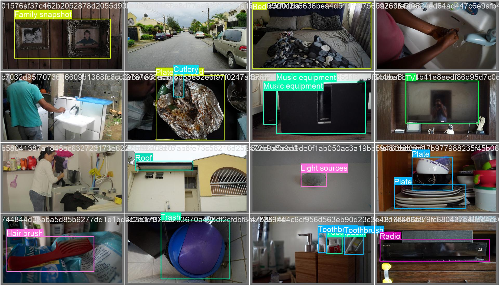
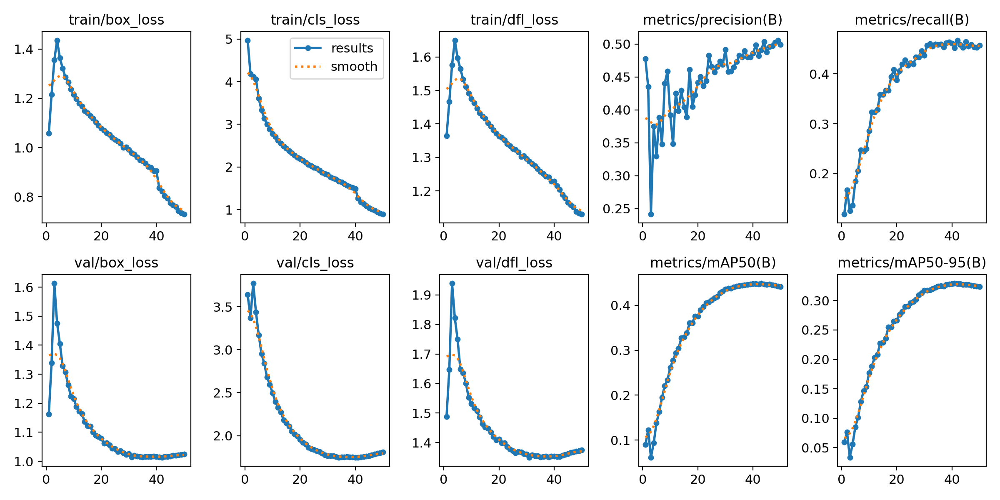
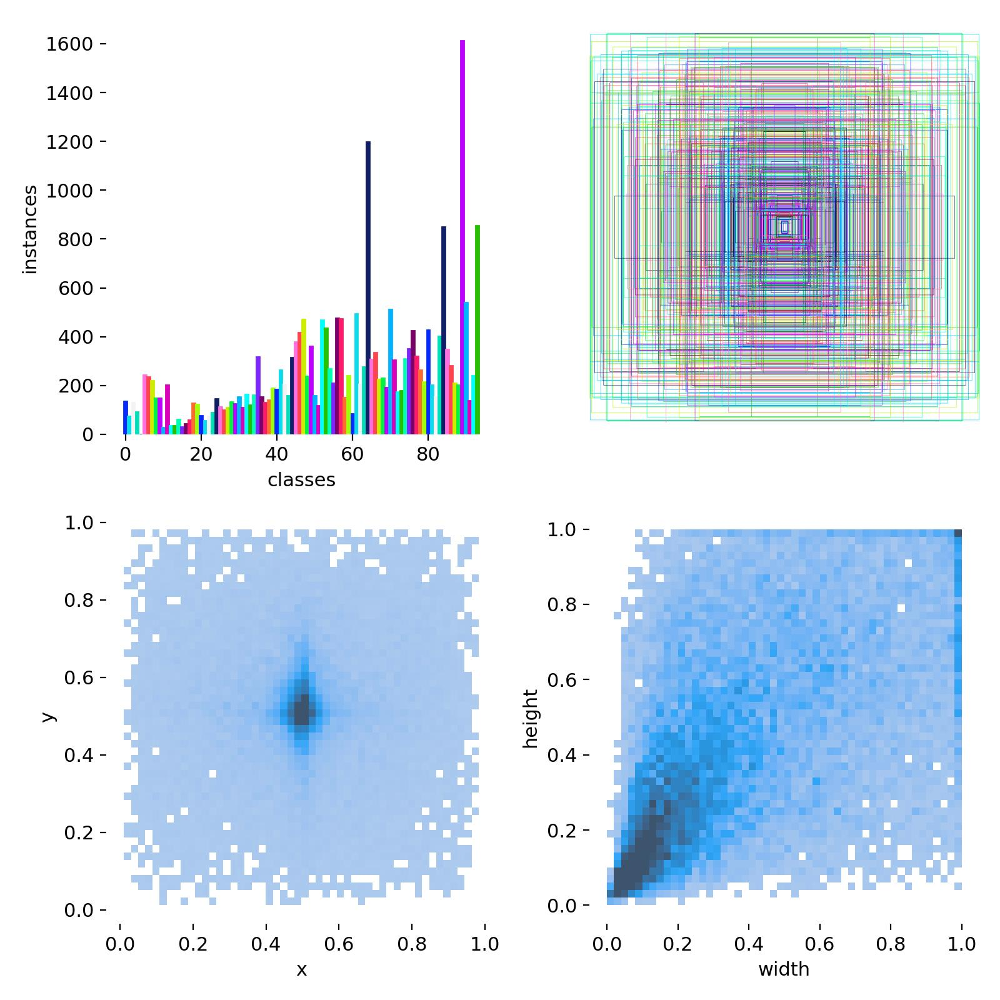
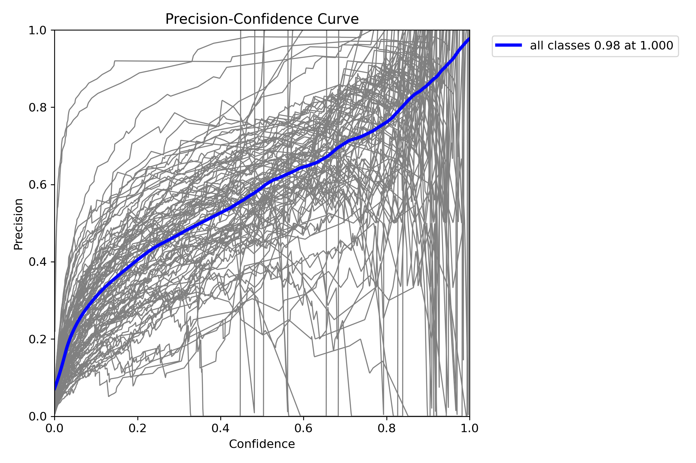
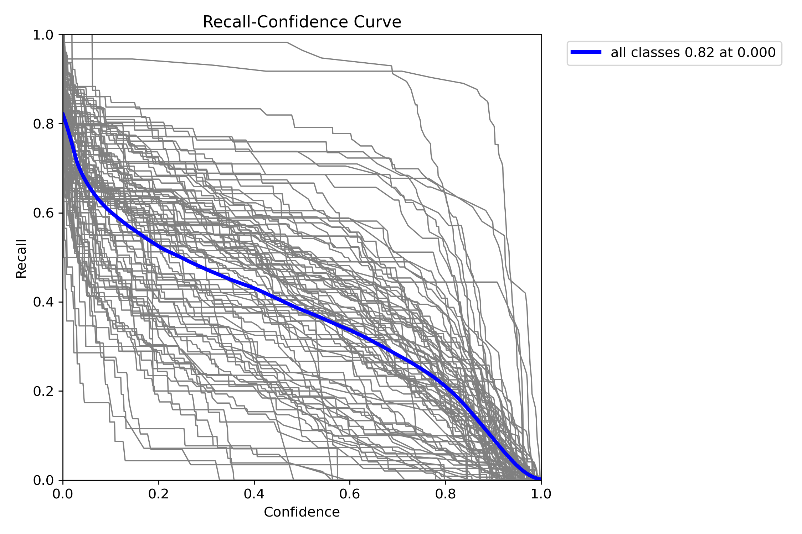

# yolo-v8s-daily-object-detection

This repository contains the code and resources for detecting daily objects using the YOLOv8s model. The project uses a custom dataset containing objects found in daily life, organized in collaboration with Gapminder and Humans in the Loop. The model has been fine-tuned and trained to identify various categories of objects in different environments.

## Project Overview

The main goal of this project is to detect and classify common objects in daily life using YOLOv8m (You Only Look Once, version 8, small model). YOLO is a state-of-the-art, real-time object detection framework that performs exceptionally well on tasks involving identifying objects in images and videos.

### Why YOLOv8?

YOLO (You Only Look Once) is a highly efficient object detection algorithm known for its speed and accuracy. YOLOv8 is the latest version, designed to be faster, more flexible, and easier to use compared to its predecessors. It comes in multiple model sizes (`n`, `s`, `m`, `l`, `x`), with YOLOv8m (medium) providing a good balance between speed and accuracy.

Key benefits of YOLOv8:
- Real-time object detection
- State-of-the-art performance on various datasets
- Flexible architecture, allowing for easy customization and fine-tuning
- Pre-trained weights available for transfer learning
- Intuitive and simple API with the `ultralytics` library

## Table of Contents

- [Installation](#installation)
- [Dataset](#dataset)
- [Training the Model](#training-the-model)
- [Results](#results)
- [Streamlit App for Prediction](#streamlit-app-for-prediction)
- [Contributing](#contributing)

## Installation

To run this project locally, you need to install the following dependencies:

1. Clone the repository:
    ```bash
    git clone https://github.com/your-username/daily-object-detection-yolov8s.git
    cd daily-object-detection-yolov8s
    ```

2. Install the required packages using pip:
    ```bash
    pip install ultralytics
    pip install -r requirements.txt
    ```

Alternatively, if you're using Kaggle or Google Colab, ensure that you install the required dependencies and set up the environment accordingly.

### Important Dependencies

- `ultralytics`: The official library for YOLOv8 models.
- `numpy`, `opencv-python`: Libraries for image manipulation and preprocessing.
- `scikit-learn`: For data splitting and preparation.
- `PyYAML`: To handle configuration files.

To install all required dependencies, you can simply run:
```bash
pip install ultralytics
pip install numpy opencv-python scikit-learn PyYAML
```
## Dataset
The dataset consists of 27,519 images of daily objects categorized into 138 different classes, divided into Abstract (18 classes), Places (25 classes), and Objects (95 classes). Each image has a corresponding annotation in YOLO format.

### Preparing the Dataset
Ensure that your dataset is organized correctly:

- Images are stored in the `images` directory.
- Annotations (in YOLO format) are stored in the `labels` directory.
- To split the data into training and validation sets, run the provided `prepare_data.py` script.

## Training the Model
Once the dataset is ready, you can train the model using the following command:
```python
from ultralytics import YOLO

# Load the YOLOv8s model
model = YOLO('yolov8s.yaml')

# Train the model
model.train(data='dataset.yaml', epochs=50, imgsz=640, batch=16)
```
### Hyperparameters
You can adjust the hyperparameters in the `train.py` script or in the YOLO configuration YAML file. Some important hyperparameters include:

- Learning rate (`lr0 `and `lrf`)
- Batch size
- Image size (`imgsz`)
## Results

After training, the results can be visualized in the `runs/train/` directory, where the model's performance on metrics like precision, recall, and mAP will be stored. Additionally, you can use Weights and Biases to track your training progress.

### Sample Results

Here are some sample results from the model:





### Visualization of Metrics

You can also visualize training metrics like loss, precision, and recall:




## Streamlit App for Prediction
We have developed a Streamlit app for real-time object detection using the trained YOLOv8m model. You can run the app locally with the following command:
```bash
streamlit run app.py
```
In the Streamlit app, you can upload an image, and the model will return predictions with bounding boxes drawn around detected objects.
### Links

- [Kaggle Dataset](https://www.kaggle.com/datasets/humansintheloop/dollar-street-dataset)
- [Weights and Biases Report of the project](https://api.wandb.ai/links/kamil-khanprogrammer-islamia-college-peshawar/23qjwkj7)
- [Launch Streamlit App](http://10.6.45.116:8501)

## Contributing

Contributions are welcome! If you have suggestions for improving the model or the repository, feel free to submit a pull request.

